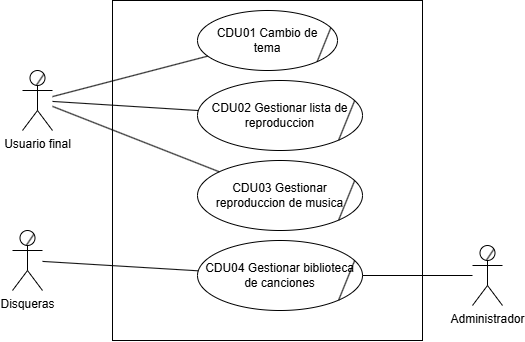
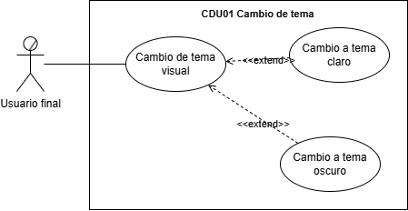

# Practica única - Documentacion Sistema de Reproducción de Música

## 1. Core del Negocio

### Descripcion

El sistema ofrece reproducción personalizada y gestión eficiente de música en un entorno digital, con enfoque en una experiencia visual adaptable, extensibilidad modular y soporte para futuras integraciones.

### Stakeholders

- **Usuario final:** Persona que utiliza el reproductor para escuchar música y gestionar sus listas de reproducción.
- **Administrador:** Responsable de gestionar la biblioteca musical, incluyendo la carga, edición y eliminación de canciones.
- **Disqueras:** Entidades proveedoras del contenido musical que buscan distribuir y promocionar su música a través del sistema.

### Diagrama CDU de Alto Nivel


### Primera Descomposición



## 2. Casos de Uso Expandidos

### Diagramas




### Listado

- **CDU01 - Cambio de tema**
- **CDU02 - Gestionar lista de reproduccion**
- **CDU03 - Gestionar reproduccion de musica**
- **CDU04 - Gestionar biblioteca de canciones**

## 3. Drivers arquitectónicos

### Requerimientos funcionales críticos (RF)

- **RF01 Cambio de tema visual:** El sistema debe permitir al usuario alternar entre temas visuales como modo claro y oscuro.
- **RF02 Reproducir canción:** El usuario debe poder iniciar la reproducción de una canción seleccionada.
- **RF03 Buscar canción:** El sistema debe permitir buscar canciones por nombre, artista o palabras clave.
- **RF04 Mostrar información de la canción:** El sistema debe mostrar título, artista y duración de la canción actual.
- **RF05 Crear lista de reproducción:** El usuario debe poder crear nuevas listas de reproducción personalizadas.
- **RF06 Editar lista de reproducción:** El usuario debe poder agregar, eliminar o reordenar canciones dentro de una lista de reproducción.
- **RF07 Cargar canciones a la biblioteca:** El administrador debe poder agregar nuevas canciones a la biblioteca del sistema.
- **RF08 Eliminar canciones de la biblioteca:** El administrador debe poder eliminar canciones existentes del catálogo musical.
- **RF09 Editar canciones de la biblioteca:** El administrador debe poder modificar los metadatos de las canciones (título, artista, etc.).

### Requisitos No Funcionales (RNF)

#### Eficiencia

* **RNF01 – Reproducción Instantánea:** El sistema debe iniciar la reproducción de una canción en menos de 1 segundo desde que se acciona el comando.
* **RNF02 – Cambio Rápido de Canción:** El cambio entre canciones debe realizarse en menos de 500 milisegundos sin interrupciones audibles.

#### Usabilidad
* **RNF03 – UI Intuitiva:** El usuario debe poder utilizar el reproductor sin necesidad de capacitación previa, con controles visibles y autoexplicativos.

#### Confiabilidad
* **RNF04 – Estabilidad Continua:** La aplicación debe poder ejecutarse durante sesiones prolongadas (mínimo 2 horas continuas) sin pérdidas de rendimiento ni cierres inesperados.

#### Mantenibilidad

* **RNF05 – Modularidad del Código:** El sistema debe estar estructurado en módulos independientes para facilitar su mantenimiento y evolución..

#### Portabilidad

* **RNF06 – Multiplataforma:** El sistema debe poder ejecutarse correctamente en distintos sistemas operativos de escritorio sin necesidad de modificaciones en el código base.

### Requisitos de Restricción (Drivers de Restricción)
* **RNF07 Plataforma permitida:** La aplicación debe desarrollarse únicamente como sistema de escritorio o aplicación web, excluyendo plataformas móviles.
* **RNF08 Uso obligatorio de patrones de diseño:** Se deben implementar al menos un patrón creacional, uno estructural y uno de comportamiento como parte de la arquitectura del sistema.
* **RNF09 Compatibilidad multiplataforma:** Si se elige una aplicación de escritorio, debe ser compatible con Windows, macOS y Linux.

## 4. Matrices de Trazabilidad

### Stakeholders vs Requerimientos

|              | RF01 Cambio de tema visual | RF02 Reproducir canción | RF03 Buscar canción | RF04 Mostrar información de la canción | RF05 Crear lista de reproducción | RF06 Editar lista de reproducción | RF07 Cargar canciones a la biblioteca | RF08 Eliminar canciones de la biblioteca | RF09 Editar canciones de la biblioteca |
| :-----------: | :------------------------: | :----------------------: | :------------------: | :--------------------------------------: | :-------------------------------: | :--------------------------------: | :-----------------------------------: | :--------------------------------------: | :------------------------------------: |
| Usuario final |             X             |            X            |          X          |                    X                    |                 X                 |                 X                 |                                      |                                          |                                        |
| Administrador |                            |                          |                      |                                          |                                  |                                    |                   X                   |                    X                    |                   X                   |
|   Disqueras   |                            |                          |                      |                                          |                                  |                                    |                   X                   |                                          |                                        |

### Stakeholders vs CDU
|		|	CDU01 Cambio de tema	|	CDU02 Gestionar lista de reproducción	|	CDU03 Gestionar reproducción de música	|	CDU04 Gestionar biblioteca de canciones	|
|:-------------:|:-----:|:-----:|:-----:|:-----:|
| Usuario final |             X             |            X            |          X          |                                        |
| Administrador |                            |                          |                      |                   X                      |
|   Disqueras   |                            |                          |                      |                   X                      |


### Requerimientos vs CDU
|		|	CDU01 Cambio de tema	|	CDU02 Gestionar lista de reproducción	|	CDU03 Gestionar reproducción de música	|	CDU04 Gestionar biblioteca de canciones	|
|:-------------:|:-----:|:-----:|:-----:|:-----:|
| RF01 Cambio de tema visual	|	X	|		|		|		|
| RF02 Reproducir canción	|		|		|	X	|		|
| RF03 Buscar canción     |		|		|	X	|	X	|
| RF04 Mostrar información de la canción     |		|		|	X	|		|
| RF05 Crear lista de reproducción     |		|	X	|		|		|
| RF06 Editar lista de reproducción     |		|	X	|		|		|
| RF07 Cargar canciones a la biblioteca     |		|		|		|	X	|
| RF08 Eliminar canciones de la biblioteca     |		|		|		|	X	|
| RF09 Editar canciones de la biblioteca     |		|		|		|	X	|

## 5. Patrones de Diseño Utilizados
### Patron Creacional - Singleton
El patron singleton se utilizo en la creacion y utilizacion de servicios que se encargaban de la logica del negocio, se utilizo tambien para crear una unica instancia de conexion a la base de datos postgres y se utilizo al final en un archivo de sesion para mantener los datos del usuario autenticado en todo el ciclo de vida de la aplicacion.
```java
public class Session {

    public static Session instance;

    private UserDTO userDTO;

    private Session() { }

    public static Session getInstance() {
        if (instance == null) instance = new Session();
        return instance;
    }

    public UserDTO getUserDTO() {
        return this.userDTO;
    }

    public void setUserDTO(UserDTO userDTO) {
        this.userDTO = userDTO;
    }

    public void logout() {
        this.userDTO = null;
    }
    
}
```
### Patron Estructural - Facade
El patrón Facade proporciona una interfaz unificada y de alto nivel que oculta la complejidad de varios componentes o clases internas, para este proyecto se utilizo para el controlador de usuario (reproductor de musica) ya que en este de manera separada se interactuaba con muchas clases que proveian los servicios necesarios para su funcionamiento, en este caso la clas MusicPlayerFacde se encaraga de la logica para la interaccion con la persistencia de datos y esta ya solo expone una unica importacion a la clase del controlador para su uso.
```java
public interface MusicPlayerFacade {

    List<SongDTO> getAllSongs();
    List<PlaylistDTO> getPlaylistsByUser(Long userId);
    List<SongDTO> getSongsInPlaylist(Long playlistId);
    void addSongToPlaylist(Long playlistId, Long songId);
    void removeSongFromPlaylist(Long playlistId, Long songId);
    void savePlaylist(NewPlaylistDTO newPlaylistDTO);
    void renamePlaylist(Long playlistId, String newName);
    void deletePlaylist(Long playlistId);

}

public class MusicPlayerFacadeImpl implements MusicPlayerFacade {

    private final SongServiceImpl songService = SongServiceImpl.getInstance();
    private final PlaylistServiceImpl playlistService = PlaylistServiceImpl.getInstance();
    private final PlaylistSongServiceImpl playlistSongService = PlaylistSongServiceImpl.getInstance();

    @Override
    public List<SongDTO> getAllSongs() {
        return songService.getAllSongs();
    }

    @Override
    public List<PlaylistDTO> getPlaylistsByUser(Long userId) {
        return playlistService.getPlaylistsByUser(userId);
    }

    @Override
    public List<SongDTO> getSongsInPlaylist(Long playlistId) {
        return playlistSongService.getSongsInPlaylist(playlistId);
    }

    @Override
    public void addSongToPlaylist(Long playlistId, Long songId) {
        playlistSongService.addSongToPlaylist(playlistId, songId);
    }

    @Override
    public void removeSongFromPlaylist(Long playlistId, Long songId) {
        playlistSongService.removeSongFromPlaylist(playlistId, songId);
    }

    @Override
    public void savePlaylist(NewPlaylistDTO newPlaylistDTO) {
        playlistService.savePlaylist(newPlaylistDTO);
    }

    @Override
    public void renamePlaylist(Long playlistId, String newName) {
        playlistService.renamePlaylist(playlistId, newName);
    }

    @Override
    public void deletePlaylist(Long playlistId) {
        playlistService.deletePlaylist(playlistId);
    }
    
}

public class UserController {

    ...

    private final MusicPlayerFacade musicFacade = new MusicPlayerFacadeImpl();

    ...

    @FXML
    private void btnAddToPlaylist() {
        PlaylistDTO selectedPlaylist = playlistListView.getSelectionModel().getSelectedItem();
        SongDTO selectedSong = libraryTableView.getSelectionModel().getSelectedItem();
        if (selectedPlaylist != null && selectedSong != null) {
            musicFacade.addSongToPlaylist(selectedPlaylist.id(), selectedSong.id());
            loadSongsFromPlaylist(selectedPlaylist);
        }
    }

}

```

### Patron de Comportamiento - Strategy
El patron strategy nos permitio poder gestionar de manera agrupada un conjunto de algoritmos en este caso para el cambio de tema, asi se puede hacer de forma dinamica y sin alterar nuestra logica, permitiendonos alternar entre tema claro y oscuro.
```java
public interface ThemeStrategy {
    void applyTheme(Scene scene);
}

public class DarkTheme implements ThemeStrategy {

    @Override
    public void applyTheme(Scene scene) {
        scene.getStylesheets().clear();
        scene.getStylesheets().add(getClass().getResource("/styles/dark.css").toExternalForm());
    }
    
}

public class LightTheme implements ThemeStrategy {

    @Override
    public void applyTheme(Scene scene) {
        scene.getStylesheets().clear();
        scene.getStylesheets().add(getClass().getResource("/styles/light.css").toExternalForm());
    }
    
}

public class ThemeManager {

    ...

    public static void toggleTheme(Scene scene) {
        isDark = !isDark;
        currentTheme = isDark ? new DarkTheme() : new LightTheme();
        currentTheme.applyTheme(scene);
        try {
            PersistenceManager.saveTheme(isDark ? "dark" : "light");
        } catch (IOException e) {
            System.err.println("Error al guardar el tema: " + e.getMessage());
        }
    }

    ...

}
```
