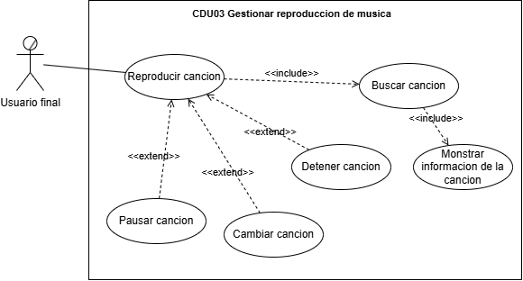

# Practica única - Documentacion Sistema de Reproducción de Música

## 1. Core del Negocio

### Descripcion

El sistema ofrece reproducción personalizada y gestión eficiente de música en un entorno digital, con enfoque en una experiencia visual adaptable, extensibilidad modular y soporte para futuras integraciones.

### Stakeholders

- **Usuario final:** Persona que utiliza el reproductor para escuchar música y gestionar sus listas de reproducción.
- **Administrador:** Responsable de gestionar la biblioteca musical, incluyendo la carga, edición y eliminación de canciones.
- **Disqueras:** Entidades proveedoras del contenido musical que buscan distribuir y promocionar su música a través del sistema.

### Diagrama CDU de Alto Nivel

### Primera Descomposición

## 2. Casos de Uso Expandidos

### Diagramas

### Listado

- **CDU01 - Experiencia de usuario**
- **CDU02 - Gestionar lista de reproduccion**
- **CDU03 - Gestionar reproduccion de musica**
- **CDU04 - Gestionar biblioteca de canciones**

## 3. Drivers arquitectónicos

### Requerimientos funcionales críticos (RF)

- **RF01 Cambio de tema visual:** El sistema debe permitir al usuario alternar entre temas visuales como modo claro y oscuro.
- **RF02 Reproducir canción:** El usuario debe poder iniciar la reproducción de una canción seleccionada.
- **RF03 Buscar canción:** El sistema debe permitir buscar canciones por nombre, artista o palabras clave.
- **RF04 Mostrar información de la canción:** El sistema debe mostrar título, artista y duración de la canción actual.
- **RF05 Crear lista de reproducción:** El usuario debe poder crear nuevas listas de reproducción personalizadas.
- **RF06 Editar lista de reproducción:** El usuario debe poder agregar, eliminar o reordenar canciones dentro de una lista de reproducción.
- **RF07 Cargar canciones a la biblioteca:** El administrador debe poder agregar nuevas canciones a la biblioteca del sistema.
- **RF08 Eliminar canciones de la biblioteca:** El administrador debe poder eliminar canciones existentes del catálogo musical.
- **RF09 Editar canciones de la biblioteca:** El administrador debe poder modificar los metadatos de las canciones (título, artista, etc.).

### Requisitos No Funcionales (RNF)

#### Eficiencia

* **RNF01 – Reproducción Instantánea:** El sistema debe iniciar la reproducción de una canción en menos de 1 segundo desde que se acciona el comando.
* **RNF02 – Cambio Rápido de Canción:** El cambio entre canciones debe realizarse en menos de 500 milisegundos sin interrupciones audibles.

#### Usabilidad

* **RNF03 – UI para Escritorio:** La interfaz debe adaptarse correctamente a sistemas operativos de escritorio como Windows, Linux y macOS.
* **RNF04 – UI Intuitiva:** El usuario debe poder utilizar el reproductor sin necesidad de capacitación previa, con controles visibles y autoexplicativos.

#### Confiabilidad

* **RNF05 – Manejo de Errores:** El sistema debe detectar archivos de audio corruptos o no compatibles, mostrando mensajes claros sin cerrarse inesperadamente.
* **RNF06 – Estabilidad Continua:** La aplicación debe poder ejecutarse durante sesiones prolongadas (mínimo 2 horas continuas) sin pérdidas de rendimiento ni cierres inesperados.

#### Mantenibilidad

* **RNF07 – Modularidad del Código:** El sistema debe estar estructurado en módulos independientes para facilitar su mantenimiento y evolución..

#### Portabilidad

* **RNF08 – Multiplataforma:** El sistema debe poder ejecutarse correctamente en distintos sistemas operativos de escritorio sin necesidad de modificaciones en el código base.
* **RNF09 – Instalación Simplificada:** El sistema debe poder distribuirse mediante un archivo ejecutable `.jar` o instalador que incluya todas las dependencias necesarias.

### Requisitos de Restricción (Drivers de Restricción)

## 4. Matrices de Trazabilidad

### Stakeholders vs Requerimientos

|              | RF01 Cambio de tema visual | RF02 Reproducir canción | RF03 Buscar canción | RF04 Mostrar información de la canción | RF05 Crear lista de reproducción | RF06 Editar lista de reproducción | RF07 Cargar canciones a la biblioteca | RF08 Eliminar canciones de la biblioteca | RF09 Editar canciones de la biblioteca |
| :-----------: | :------------------------: | :----------------------: | :------------------: | :--------------------------------------: | :-------------------------------: | :--------------------------------: | :-----------------------------------: | :--------------------------------------: | :------------------------------------: |
| Usuario final |             X             |            X            |          X          |                    X                    |                 X                 |                 X                 |                                      |                                          |                                        |
| Administrador |                            |                          |                      |                                          |                                  |                                    |                   X                   |                    X                    |                   X                   |
|   Disqueras   |                            |                          |                      |                                          |                                  |                                    |                   X                   |                                          |                                        |

### Stakeholders vs CDU

### Requerimientos vs CDU
